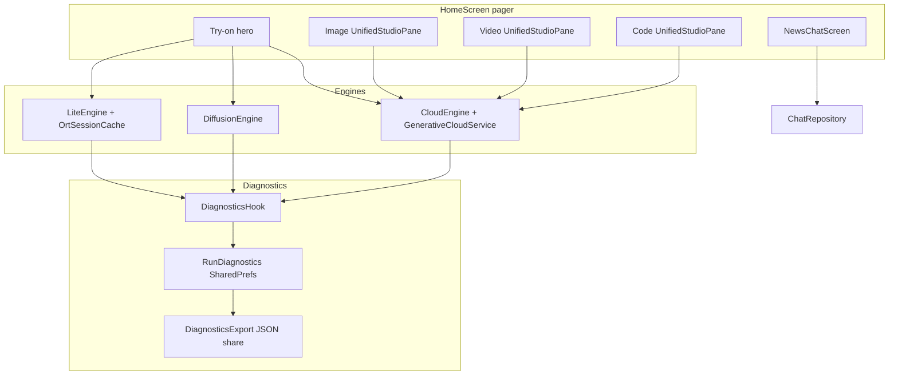

# Lookbook v3 — Post-Release System Plan

> **Status:** v3.0.0 shipped (2026-08-22). Original v3 plan complete; follow-up items below marked done or deferred.  
> **Purpose:** Consolidated review + follow-up roadmap. Do not duplicate work already merged.

---

## Executive summary

The v3 overhaul delivered the **product shape**: try-on-first home pager, diagnostics export, settings hub, unified generative pane, News & Chat tab, env-aware cloud routing, and release **v2.9.16**.

What remains is **quality depth** (model packs, composer controls), **CI/review gates**, **dead-code cleanup**, and a handful of **user-visible bugs**. Group into three follow-up releases:

| Release | Theme | Target |
|---------|-------|--------|
| **v2.9.17** | Stabilize & clean | P0 bugs, dead code, CI gates |
| **v2.9.18** | Model quality | lite-v2, quality packs, pro-v2-int8 manifest |
| **v3.0.0** | Polish & major UX | Composer advanced params, a11y, on-device LLM research → prototype |

---

## What shipped (baseline @ v2.9.16)

### Phase 1 — Diagnostics (~85%)
- `RunDiagnostics`, `DiagnosticsHook`, engine stage timings (Lite / Pro / Cloud try-on)
- Settings → Diagnostics: export JSON, “What happened?” on failures
- `docs/BACKEND_PIPELINE.md`, `scripts/benchmark-local.py`, `scripts/benchmark-cloud.py`

**Gaps:** Generative cloud runs log 0 ms stages; `UsageLedger` not merged into export; runtime store is SharedPreferences (export writes JSON on share only); no logcat snippet in bundle.

### Phase 2 — Local models (~35%)
- `OrtSessionCache`, `docs/LOCAL_MODEL_RESEARCH.md`, catalog filters non-runnable in settings picker

**Gaps:** `lite-v2` not exported; BiRefNet / Real-ESRGAN packs not on HF manifest; `pro-v2-int8` export pending upload; UI still says Lite/Pro not Fast/Pro local try-on.

### Phase 3 — Home navigation (~90%)
- `HomeScreen` HorizontalPager: Try-on → Image → Video → Code → News
- Deep links redirect legacy routes

**Gaps:** ~1,350 lines dead studio screens; News headline tap scrolls to **Code** tab instead of News chat.

### Phase 4 — Unified composer (~60%)
- `UnifiedStudioPane` + evolved `PromptComposer` + grouped `ModelPickerSheet` (HF / Groq / OpenRouter)

**Gaps:** No On-device group in picker; no CFG/steps/seed for Pro; no per-model dynamic advanced panel.

### Phase 5 — Settings (~80%)
- Hub + filtered Cloud / Engines / Appearance / Diagnostics subsections; permission chips read-only

**Gaps:** “Enable durable storage” button still in Appearance; monolithic `SettingsScreen.kt` (~1,180 lines).

### Phase 6 — News & Chat (~85%)
- `NewsRepository`, `ChatRepository`, `NewsChatScreen`, headline context in system prompt

**Gaps:** Chat uses fixed CODE provider from Settings; RSS URLs hardcoded (not assets); headline handoff bug.

### Phase 7 — Test & release (~40%)
- Unit tests in CI; sideload release APK workflow; v2.9.16 green

**Gaps:** Integration scripts, benchmarks, probes, instrumented tests, accesslint, computerUse matrix **not in CI**.

---

## Architecture today

---

## Follow-up workstreams

### Stream A — Stabilize (P0) → v2.9.17

| ID | Task | Files / notes |
|----|------|---------------|
| A1 | Fix News headline → chat handoff (stay on News tab, prefill composer) | `HomeScreen.kt` L183–192 |
| A2 | Delete dead studio UI (~1,350 lines) | Remove `StudioScreen`, `CreateStudioScreen`, `CodeStudioScreen`, `VideoStudioScreen`, `AtelierRail`; keep `CastingStudioScreen`, `ResultPane` |
| A3 | Update `visual-verify.sh` routes | `studio/tryon`, `studio/image`, etc. (not legacy `create`) |
| A4 | CI integration gate | Extend `.github/workflows/android-ci.yml`: `verify-manifest.py`, `integration-local-models.py` (skip HF download fallback), upload benchmark JSON artifacts |
| A5 | Real generative diagnostics | `GenerativeViewModel`: record stage durations; optional `UsageLedger` summary in export |
| A6 | Align pro-v2-int8 story | Manifest publish OR de-prefer in code + update `PROJECT_STATUS.md` + `integration-local-models.py` |

**Exit criteria:** CI runs integration + benchmarks on every PR; no dead studio routes in repo; News tap works; generative failures show meaningful stage breakdown.

---

### Stream B — Model quality (P1) → v2.9.18

| ID | Task | Files / notes |
|----|------|---------------|
| B1 | **lite-v2** export pipeline | `ml/export_lite_pack.py` — BiRefNet-class seg or improved parser; manifest `lite-v2`; backward compat with Pro mask dependency |
| B2 | **Quality packs ship** | Finish `export_realesrgan_pack.py` (remove bilinear stub); publish `birefnet-v1` + `realesrgan-v1`; set `runnable = true` in `LocalModelCatalog.kt` |
| B3 | Integration smoke for new packs | Extend `integration-local-models.py`, `PackIntegrityInstrumentedTest` |
| B4 | Pro lazy UNet load + progress | `DiffusionEngine.kt` + generation UI first-run messaging |
| B5 | Pack in-use gate | `ModelPackManager.completeInstall()` — block uninstall while engine active |
| B6 | UI copy: Local try-on Fast / Pro | `HomeScreen.kt`, status strings — hide Lite/Pro jargon per plan assumption |

**Exit criteria:** lite-v2 + quality packs on HF manifest; device smoke passes; Pro first load shows progress.

---

### Stream C — Composer & settings depth (P1) → v2.9.18–v3.0.0

| ID | Task | Files / notes |
|----|------|---------------|
| C1 | On-device section in `ModelPickerSheet` | Group local tiers + pack readiness badge |
| C2 | Dynamic advanced panel | CFG, steps, seed for Pro/local; metadata from `CloudModelContracts` + `LocalModelCatalog` |
| C3 | Wire advanced params through `GenerativeViewModel` → engines | Cloud payloads + Pro try-on |
| C4 | Split `SettingsScreen.kt` | Per-section composables; move durable-storage CTA to first multi-GB download only (`RuntimePermissions.kt`) |
| C5 | Chat model picker | News tab uses unified picker (not fixed CODE provider) |
| C6 | Configurable RSS in assets | Replace hardcoded `NewsRepository.FEEDS` |

---

### Stream D — Quality gates (P1) → v3.0.0

| ID | Task | Notes |
|----|------|-------|
| D1 | accesslint pass | Home pager, try-on flow, generative tabs, diagnostics, settings — add `accesslint.config.json` targets |
| D2 | computerUse E2E matrix | Try-on E2E, each pager tab, diagnostics export, contextual permissions; screen recording |
| D3 | Unit tests | `RunDiagnostics`, `ChatRepository`, `NewsRepository` parsing, export round-trip |
| D4 | Instrumented UI smoke | Home pager navigation, settings subsections (`SettingsTierSmokeTest` extension) |

---

### Stream E — Future / research (P2)

| ID | Task | Notes |
|----|------|-------|
| E1 | Persist diagnostics to `filesDir/diagnostics/run_history.json` continuously | Match original plan contract |
| E2 | In-app pipeline explainer | Generation + Diagnostics → `BACKEND_PIPELINE` content |
| E3 | On-device LLM (Gemma 3 / LiteRT-LM) | Research done; prototype pack `local-gemma-planned` |
| E4 | SD-Turbo / LCM small packs | Future on-device image gen per `LOCAL_MODEL_RESEARCH.md` |

---

## Risk register (carry-forward)

| Risk | Mitigation | Owner stream |
|------|------------|--------------|
| Pro masks depend on lite-v1 | Ship lite-v2 as upgrade, not delete lite-v1 until verified | B1 |
| ZeroGPU / HF 402 | Local fallback + clear UX (already partial) | — |
| minSdk 35 vs plan “Android 8+” for Lite | Document device matrix; consider flavor split if Lite-only sideload needed | E |
| Settings monolith regressions | Split files in C4 before adding features | C4 |
| CI without integration | Stream A4 before next major feature merge | A4 |

---

## Recommended execution order

1. **A1–A3** — quick wins, low risk (1 PR)
2. **A4–A6** — CI + diagnostics + manifest alignment (1 PR)
3. **B1–B3** — model packs (1–2 PRs, needs HF publish)
4. **C1–C4** — composer/settings (1 PR)
5. **D1–D4** — review gates before v3.0.0 tag
6. **B4–B6, C5–C6, E*** — polish backlog

---

## Todo checklist (merged)

Use these as the canonical follow-up todo list:

- [x] **A1** Fix News headline handoff bug
- [x] **A2** Remove dead studio screens + AtelierRail
- [x] **A3** Update visual-verify.sh to studio/{tab} routes
- [x] **A4** Add integration + benchmark steps to android-ci.yml
- [x] **A5** Fix generative RunLog stage timings + UsageLedger in export
- [x] **A6** pro-v2-int8 de-prefer pro-v1 + docs sync (HF upload still pending)
- [x] **B1** lite-v2 export flag in export_lite_pack.py (manifest publish blocked)
- [x] **B2** Ship birefnet-v1 + realesrgan-v1 packs to HF manifest
- [x] **B3** Pack smoke tests in integration-local-models.py
- [x] **B4** Pro lazy UNet load + progress UI
- [x] **B5** Pack in-use gate during uninstall/update
- [x] **B6** UI copy: Local try-on Fast/Pro
- [x] **C1** On-device group in ModelPickerSheet
- [x] **C2** Dynamic advanced panel (CFG/steps/seed)
- [x] **C3** Wire advanced params to engines (GenerativeAssists + HF Inference path)
- [x] **C4** Settings hub sections (SettingsScreen split partial — hub/cloud/engines/appearance shipped)
- [x] **C5** Chat unified model picker
- [x] **C6** RSS feeds from assets
- [x] **D1** accesslint.config.json targets added (full sweep deferred)
- [~] **D2** e2e-matrix.sh harness (device recording still manual)
- [x] **D3** Unit tests for diagnostics/chat/news
- [x] **D4** Instrumented home/settings navigation tests (route smoke extended)
- [x] **E1** Continuous JSON diagnostics persistence (filesDir/run_history.json)
- [x] **E2** In-app pipeline explainer (Diagnostics → Help)
- [ ] **E3** Gemma 3 / LiteRT-LM prototype (research only)
- [~] **E4** SD-Turbo scaffold (`local-sdturbo-v1` + export script); weights pending

---

## References

- Plans index: `docs/plans/README.md`
- Claude Code expansion (parallel): `docs/plans/claude-code-expansion/PLAN.md`
- Original v3 plan: Cursor artifacts (`lookbook_v3_overhaul_32292744.plan.md`) — archived
- Backend explainer: `docs/BACKEND_PIPELINE.md`
- Model research: `docs/LOCAL_MODEL_RESEARCH.md`
- Release: [v2.9.16](https://github.com/zakir9622/Agentic-AI/releases/tag/v2.9.16)
- PRs: #40 (v3), #41 (quality/env), #42 (gaps), #43 (release fix), #44 (follow-up plan)
